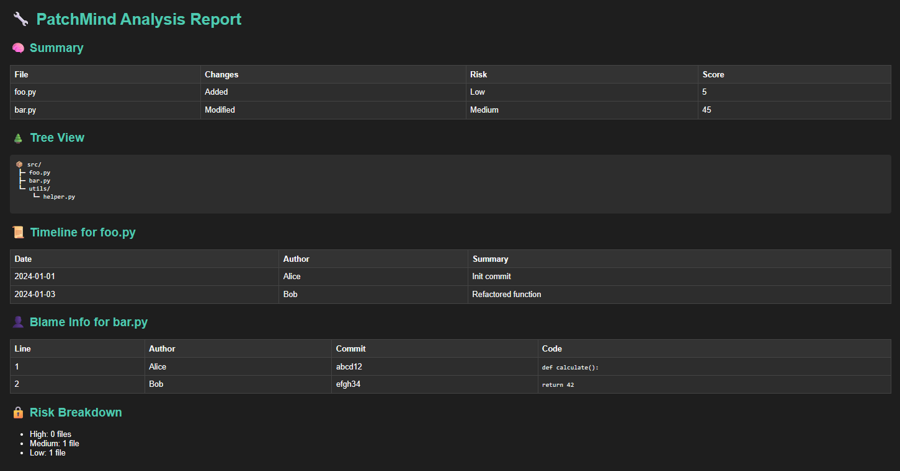

# 🧠 PatchMind

[](https://github.com/Darkstar420/patchmind/actions/workflows/patchmind.yml)
[](https://github.com/Darkstar420/patchmind/actions/workflows/publish.yml)
[](https://pypi.org/project/patchmind/)
[](https://opensource.org/licenses/Apache-2.0)

**PatchMind** is a modular Python-based framework that monitors a local Git repository and generates intelligent HTML reports with patch-level diffs, tree views, file history timelines, risk scoring, and more. 

Designed for developers who want **lightweight tools** to keep their codebase clean and up to date — without another bloated assistant.

---

## 🚀 Features

- 🔍 Patch-level file change detection
- 🌳 Tree-based visualization of modified files
- 📅 File history timeline with author and commit metadata
- ⚠️ File impact score and risk analysis
- 👤 Line-level blame summary
- 🧾 One-click HTML report generation via CLI

---

## 📸 Sample Output



---

## 📦 Installation

Install directly from PyPI:

```bash
pip install patchmind
````

Or clone and install manually:

```bash
git clone https://github.com/Darkstar420/patchmind.git
cd patchmind
pip install -r requirements.txt
```

---

## 🧪 Usage

Run the tool from the project directory:

```bash
python cli/main.py --report
```

This command will analyze the Git repository and generate a standalone HTML report: `patchmind_report.html`.

---

## 🧱 Project Structure

```
patchmind/
├── cli/
│   └── main.py
├── core/
│   ├── engine.py
│   ├── reporter.py
│   ├── summarizer.py
│   ├── insight.py
│   └── visualizer.py
├── tests/
│   └── test_reporter.py
├── docs/
│   └── patchmind_report_sample.png
├── config.yaml
├── requirements.txt
└── README.md
```

---

## ✅ Why PatchMind?

* Zero-setup, fast local analysis
* Fully offline, no cloud required
* Clear visualizations of code evolution
* Designed for speed, not ceremony

---

## 🧪 Testing

To run unit tests:

```bash
pytest -q
```

Tests are located in `tests/test_reporter.py` and validate report generation using mocks.

---

## 📄 License

Apache 2.0 — free to use, modify, and build on.
